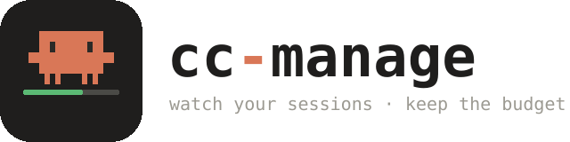
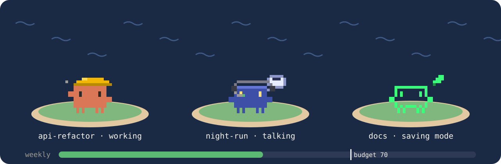
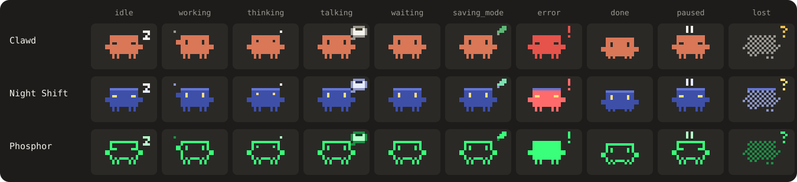
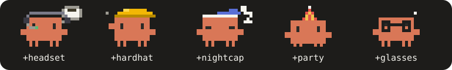

<p align="center">
  <picture>
    <source media="(prefers-color-scheme: dark)" srcset="docs/assets/logo-dark.svg">
    
  </picture>
</p>

<p align="center">
  A <a href="https://code.claude.com/docs/en/plugins/mods/overview">Claude Code mod</a> that watches your sessions,
  keeps token use inside a budget you set, and saves tokens on its own — without lowering code quality.
</p>

<p align="center"></p>

## Why

You leave sessions running overnight and the plan's limit runs out at 3 a.m. with the work half done.
cc-manage estimates whether the budget will cover the rest of the task and, when it will not, steps
through saving tiers early instead of stopping late. Every change is shown with its reason. Nothing is
lowered silently, and safety, correctness and working code are never traded away.

## What it does

| | |
|---|---|
| **Usage bars** | Weekly and 5-hour use, read from your real plan limits (Pro / Max). |
| **Budget, not a wall** | Set a weekly target. Going over only turns the bar red and shows a warning. |
| **Forecast** | Per step: spent + average per step × steps left × safety factor. "At this pace the budget ends at step 14." |
| **Saving tiers** | Light → Medium → Strict, with hysteresis so it does not flip back and forth. Rules live in [`mod/config/tiers.json`](mod/config/tiers.json). |
| **Sessions panel** | Every running session with its current step, progress, tokens and state. Click one to see what it does. |
| **Between sessions** | Short messages with a loop guard; ask another session to pause cleanly. |
| **Web panel** | Optional claude.ai page with the same data, for the app, the browser and your phone. |
| **Clawd** | Each session is a pixel Clawd that shows its state. |

## Clawd

Three designs, ten states each, all animated. Drawn with half blocks in the terminal and as SVG on the desktop.

<p align="center"></p>

Accessories go on and off by state or by hand: `/clawd clawd talker`, `/clawd +hardhat`.

<p align="center"></p>

Bring your own art: [`mod/characters/README.md`](mod/characters/README.md).

## Install

In Claude Code (terminal or the desktop Code tab):

```
/plugin install session-budget --marketplace Msh4i/cc-manage
```

Answer `y` to add the marketplace and pick the **User** scope to have it in every local session.

**Every cloud session**, whatever the repository: add this line to your cloud environment's setup script.

```bash
claude plugin marketplace add Msh4i/cc-manage && claude plugin install session-budget@session-budget-tools
```

**One repository**: commit this as `.claude/settings.json`.

```json
{
  "extraKnownMarketplaces": { "session-budget-tools": { "source": { "source": "github", "repo": "Msh4i/cc-manage" } } },
  "enabledPlugins": { "session-budget@session-budget-tools": true }
}
```

## Use

| Command | |
|---|---|
| `/manage` | Open the panel. Where no panel can be drawn (cloud, VS Code, mobile) you get a text report. |
| `/tier auto` · `/tier off` · `/tier 0-4` | Automatic saving on or off, or pick a tier by hand. |
| `/msg <session> <text>` | Leave a short message for another session. |
| `/pause [session]` | Pause this session cleanly, or ask another to. |
| `/clawd [id [variant]] [+acc] [-acc]` | Pick a character, variant and accessories. |
| `/web <artifact url>` | Send this session's data to your web panel. |

Budgets are in points of the weekly limit (70 = 70 % of the week). Set them in the panel or the web page.

## Where it runs

| Surface | Hooks and saving | Panel |
|---|---|---|
| Terminal, desktop Code tab | yes | yes |
| Cloud sessions, VS Code, mobile | yes | text report, or the web panel |

## Development

```
claude --plugin-dir ./mod
claude plugin validate mod
claude plugin test mod
```

More: [docs/USAGE.md](docs/USAGE.md) (Turkish). Licence: MIT. Notices: [THIRD_PARTY_NOTICES.md](THIRD_PARTY_NOTICES.md).
